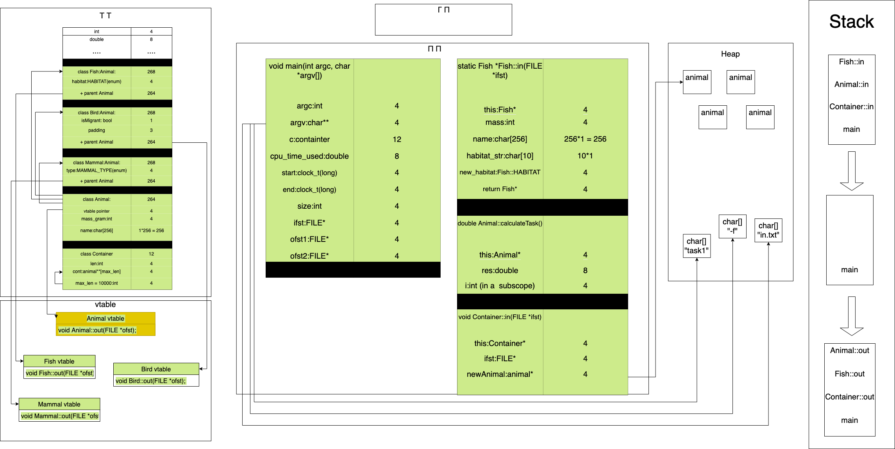

Пояснительная записка.

* описание полученного задания;  

  Файл PDF(task2.pdf) лежит в файлах проекта.  
  Вариант 68.  

  Обобщенный артефакт, используемый в задании | Базовые альтернативы(уникальные параметры, задающие отличительные признаки альтернатив | Общие для всех альтернатив переменные | Общие для всех альтернатив функции
    ------------ | ------------- | ------------ | ------------
  12.Животные | 1. Рыбы (место проживания – перечислимый тип: река, море, озеро…)   2. Птицы (отношение к перелету: перелетные, остающиеся на зимовку – булевская величина)  3. Звери (хищники, травоядные, насекомоядные… – перечислимый тип) | 1. Название – строка символов,   2. Вес в граммах (целое) | Частное от деления суммы кодов незашифрованной строки на вес (действительное число)

  5.Упорядочить элементы контейнера по возрастанию используя сортировку Шелла (Shell Sort). В качестве ключей для сортировки и других действий используются результаты функции, общей для всех альтернатив.

* структурная схема изучаемой архитектуры ВС с размещенной на ней разработанной программы;
  
* требуемые метрики, определяющие характеристики программы, для различных тестовых прогонов.
  
  N | Произошла ли запись на диск | Время
  ------------ | ------------- | ------------
  100 | Да | 4ms
  1000 | Да | 130ms
  10000 | Да | 16103ms
  100 | Нет | 1ms
  1000 | Нет | 116ms
  10000 | Нет | 15741ms

* данные, демонстрирующие сравнение с характеристиками ранее разработанных программ.
  
  Достоинства: меньше исходного кода (размер исходников: 14.8КБ vs 20.5КБ)

  Минусы: больше размер скомпилированного кода (59КБ vs 55КБ).
  Видимо связано с переходом с C на C++.

* основные характеристики программы:
  1) Число заголовочных файлов: 6
  2) Число модулей реализации: 6 (не считая main)
  3) Общий размер исходных текстов: 14,8 КБ
  4) Размер .exe: 181 КБ
  5) Размер Unix Executable: 59 КБ