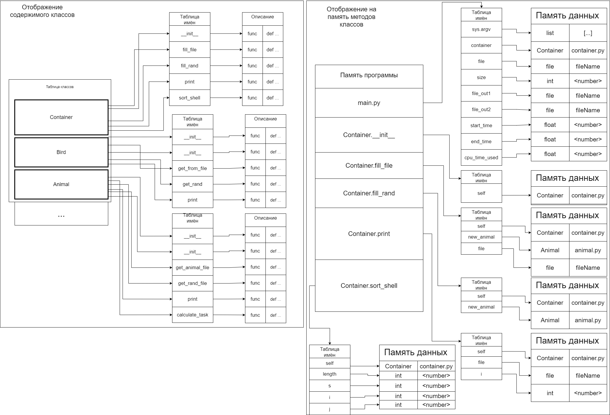

Пояснительная записка.

* описание полученного задания;  

  Файл PDF(task3.pdf) лежит в файлах проекта.  
  Вариант 68.  

  Обобщенный артефакт, используемый в задании | Базовые альтернативы(уникальные параметры, задающие отличительные признаки альтернатив | Общие для всех альтернатив переменные | Общие для всех альтернатив функции
    ------------ | ------------- | ------------ | ------------
  12.Животные | 1. Рыбы (место проживания – перечислимый тип: река, море, озеро…)   2. Птицы (отношение к перелету: перелетные, остающиеся на зимовку – булевская величина)  3. Звери (хищники, травоядные, насекомоядные… – перечислимый тип) | 1. Название – строка символов,   2. Вес в граммах (целое) | Частное от деления суммы кодов незашифрованной строки на вес (действительное число)

  5.Упорядочить элементы контейнера по возрастанию используя сортировку Шелла (Shell Sort). В качестве ключей для сортировки и других действий используются результаты функции, общей для всех альтернатив.

* структурная схема изучаемой архитектуры ВС с размещенной на ней разработанной программы;
  
* требуемые метрики, определяющие характеристики программы, для различных тестовых прогонов.
  
  N | Время
  ------------ | ------------
  100 | 42ms
  1000 | 3109ms
  10000 | 385568ms

* данные, демонстрирующие сравнение с характеристиками ранее разработанных программ.
  
  Достоинства: меньше исходного кода (размер исходников: 8.84КБ vs 14.8КБ)

  Минусы: гораздо большее время работы кода (Тест на N=10000: 385568ms vs 15741ms).
  Так как Python - интерпретируемый язык.

* основные характеристики программы:
  1) Число заголовочных файлов: 5
  2) Число модулей реализации: 5 (не считая main)
  3) Общий размер исходных текстов: 8.84 КБ